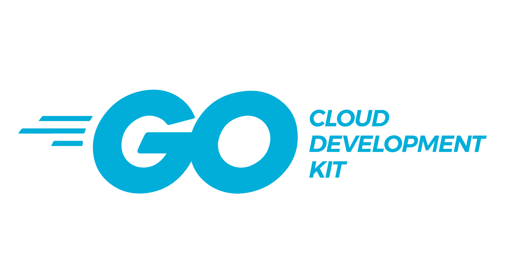

# The Go Cloud Development Kit (Go CDK)

_Write once, run on any cloud ☁️_

[][travis]
[][godoc]
[](https://codecov.io/gh/google/go-cloud)
[](https://goreportcard.com/report/github.com/google/go-cloud)

<p align="center">
  
</p>

The Go Cloud Development Kit (Go CDK) allows Go application developers to
seamlessly deploy cloud applications on any combination of cloud providers. It
does this by providing stable, idiomatic interfaces for common uses like storage
and databases. Think `database/sql` for cloud products.

Imagine writing this to read from blob storage (like Google Cloud Storage or
S3):

```go
ctx := context.Background()
bucket, err := blob.OpenBucket(ctx, "s3://my-bucket")
if err != nil {
    return err
}
defer bucket.Close()
blobReader, err := bucket.NewReader(ctx, "my-blob", nil)
if err != nil {
    return err
}
```

and being able to run that code on any cloud you want, avoiding all the ceremony
of cloud-specific authorization, tracing, SDKs and all the other code required
to make an application portable across cloud platforms.

The project works well with a code generator called
[Wire](https://github.com/google/wire/blob/master/README.md). It creates
human-readable code that only imports the cloud SDKs for services you use. This
allows the Go CDK to grow to support any number of cloud services, without
increasing compile times or binary sizes, and avoiding any side effects from
`init()` functions.

You can learn more about the project from our [announcement blog post][], or our
talk at Next 2018:

[][video]

[announcement blog post]: https://blog.golang.org/go-cloud
[godoc]: https://godoc.org/github.com/google/go-cloud
[travis]: https://travis-ci.com/google/go-cloud
[video]: https://www.youtube.com/watch?v=_2ZwhvIkgek

## Installation

```shell
# First "cd" into your project directory if you have one to ensure "go get" uses
# Go modules (or not) appropriately. See "go help modules" for more info.
go get gocloud.dev
```

The Go CDK builds at the latest stable release of Go. Previous Go versions may
compile but are not supported.

## Documentation

Documentation for the project lives primarily on https://gocloud.dev/, including
[tutorials][].

You can also browse Go package reference on [godoc.org][godoc].

[tutorials]: https://gocloud.dev/tutorials/

## Project status

The APIs are still in alpha, but we think they are production-ready and are
actively looking for feedback from early adopters. If you have comments or
questions, you can post to the [go-cloud mailing list][] or email us at
go-cdk-feedback@google.com.

## Current features

The Go CDK provides generic APIs for:

*   Unstructured binary (blob) storage
*   Publish/Subscribe (pubsub)
*   Variables that change at runtime (runtimevar)
*   Connecting to MySQL and PostgreSQL databases (mysql, postgres)
*   Server startup and diagnostics: request logging, tracing, and health
    checking (server)

## Contributing

Thank you for your interest in contributing to the Go Cloud Development
Kit! :heart:

Everyone is welcome to contribute, whether it's in the form of code,
documentation, bug reports, feature requests, or anything else. We encourage you
to experiment with the Go CDK and make contributions to help evolve it to meet
your needs!

The GitHub repository at [google/go-cloud][go-cloud] contains some driver
implementations for each portable API. We intend to include
[Google Cloud Platform][gcp], [Amazon Web Services][aws], and [Azure][azure]
implementations, as well as prominent open source services and at least one
implementation suitable for use in local testing. Unfortunately, we cannot
support every service directly from the project; however, we encourage
contributions in separate repositories.

If you create a repository that implements the Go CDK interfaces for other
services, let us know! We would be happy to link to it here and give you a
heads-up before making any breaking changes.

See [the contributing guide](./CONTRIBUTING.md) for more details.

[go-cloud]: https://github.com/google/go-cloud
[gcp]: http://cloud.google.com
[aws]: http://aws.amazon.com
[azure]: https://azure.microsoft.com/

## Community

You can contact us on the [go-cloud mailing list][].

This project is covered by the Go [Code of Conduct][].

[Code of Conduct]: ./CODE_OF_CONDUCT.md
[go-cloud mailing list]: https://groups.google.com/forum/#!forum/go-cloud

## Legal disclaimer

The Go CDK is open-source and released under an [Apache 2.0
License](https://github.com/google/go-cloud/blob/master/LICENSE). Copyright ©
2018–2019 The Go Cloud Development Kit Authors.

If you are looking for the website of GoCloud Systems, which is unrelated to the
Go CDK, visit https://gocloud.systems.
