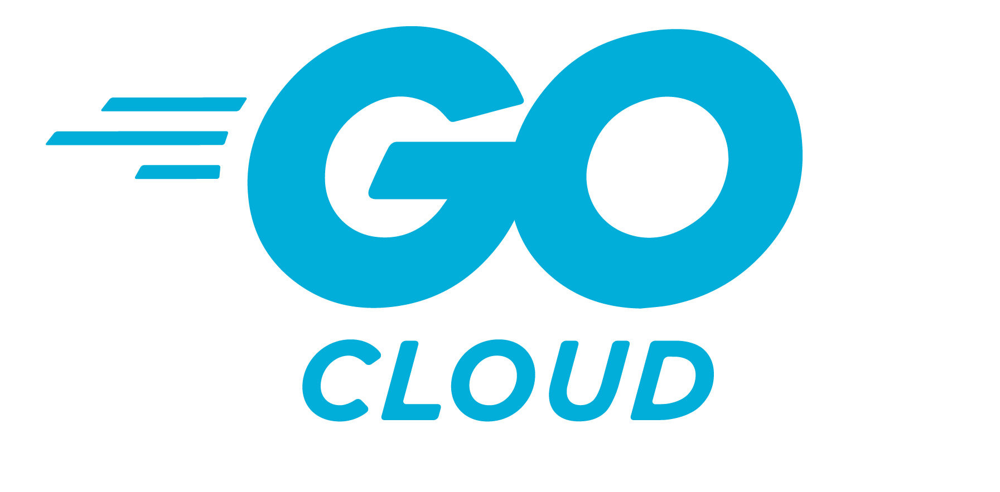

# The Go Cloud Project

_Write once, run on any cloud ☁️_

[][travis]
[][godoc]
[](https://coveralls.io/github/google/go-cloud?branch=master)

The Go Cloud Project is an initiative that will allow application developers to
seamlessly deploy cloud applications on any combination of cloud providers. It
does this by providing stable, idiomatic interfaces for common uses like storage
and databases. Think `database/sql` for cloud products.

Imagine writing this to read from blob storage (like Google Cloud Storage or
S3):

```go
blobReader, err := bucket.NewReader(context.Background(), "my-blob", nil)
```

and being able to run that code on any cloud you want, avoiding all the ceremony
of cloud-specific authorization, tracing, SDKs and all the other code required
to make an application portable across cloud platforms.

The project works well with a code generator called
[Wire](https://github.com/google/wire/blob/master/README.md). It
creates human-readable code that only imports the cloud SDKs for providers you
use. This allows Go Cloud to grow to support any number of cloud providers,
without increasing compile times or binary sizes, and avoiding any side effects
from `init()` functions.

You can learn more about the project from our [announcement blog post][], or our
talk at Next 2018:

[][video]

[announcement blog post]: https://blog.golang.org/go-cloud
[godoc]: https://godoc.org/github.com/google/go-cloud
[travis]: https://travis-ci.com/google/go-cloud
[video]: https://www.youtube.com/watch?v=_2ZwhvIkgek

## Installation instructions

```shell
# First "cd" into your project directory if you have one to ensure "go get" uses
# Go modules (or not) appropriately. See "go help modules" for more info.
go get gocloud.dev
go get github.com/google/wire/cmd/wire
```

Go Cloud builds at the latest stable release of Go. Previous Go versions may
compile but are not supported.

## Samples

[`samples/tutorial`][tutorial] shows how to get started with the project by
using blob storage.

[`samples/guestbook`][guestbook] contains an example guestbook application (just
like it's 1999!) that can be run locally, on Google Cloud Platform or on Amazon
Web Services. The instructions take about 5 minutes to follow if running
locally. If you want to see the guestbook app running on cloud resources, it
will take about 30 minutes to follow, and uses [Terraform](http://terraform.io)
to automatically provision the resources needed.

[tutorial]: https://github.com/google/go-cloud/tree/master/samples/tutorial
[guestbook]: https://github.com/google/go-cloud/tree/master/samples/guestbook
[gcmsg]: https://github.com/google/go-cloud/tree/master/pubsub/samples/gcmsg

## Project status

**This project is in alpha and is not yet suitable for production.**

While in alpha, the API is subject to breaking changes.

## Current features

Go Cloud provides generic APIs for:

*   Unstructured binary (blob) storage
*   Publish/Subscribe (pubsub)
*   Variables that change at runtime (configuration)
*   Connecting to MySQL databases
*   Server startup and diagnostics: request logging, tracing, and health
    checking

## Contributing

Thank you for your interest in contributing to Go Cloud! :heart:

Everyone is welcome to contribute to Go Cloud, whether it's in the form of code,
documentation, bug reports, feature requests, or anything else. We encourage you
to experiment with Go Cloud and make contributions to help evolve it to meet
your needs!

The GitHub repository at [google/go-cloud[go-cloud] contains some provider
implementations for each portable API. We intend to include [Google Cloud
Platform][gcp], [Amazon Web Services][aws], and
[Azure][https://azure.microsoft.com/] implementations, as well as prominent open
source providers and at least one implementation suitable for use in local
testing. Unfortunately, we cannot support every cloud provider directly from the
project; however, we encourage contributions in separate repositories.

If you create a repository that implements the Go Cloud interfaces for other
providers, let us know! We would be happy to link to it here and give you
a heads-up before making any breaking changes.

See [the contributing guide](./CONTRIBUTING.md) for more details.

[go-cloud]: https://github.com/google/go-cloud
[gcp]: http://cloud.google.com
[aws]: http://aws.amazon.com
[azure]: https://azure.microsoft.com/

## Community

You can contact us on the [go-cloud mailing list][].

This project is covered by the Go [Code of Conduct][].

[Code of Conduct]: ./CODE_OF_CONDUCT.md
[go-cloud mailing list]: https://groups.google.com/forum/#!forum/go-cloud
