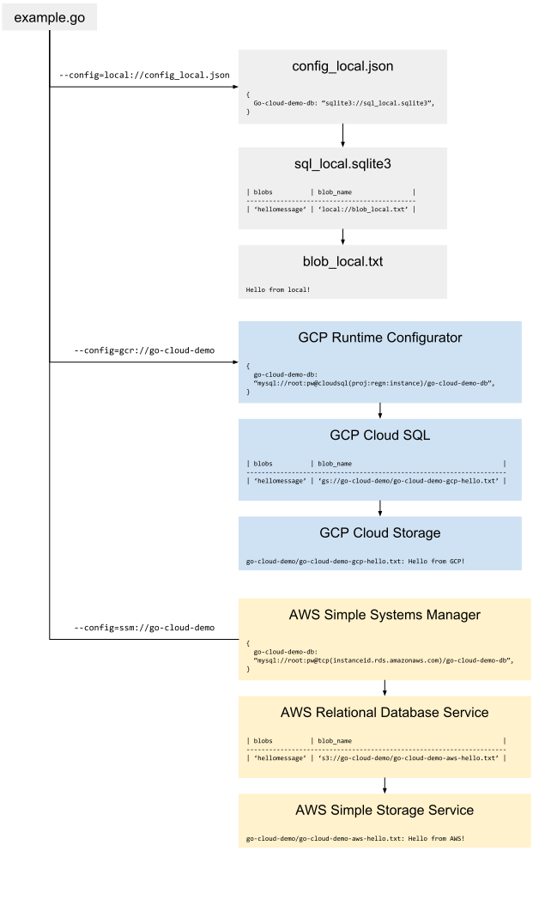

# Example application

The example application uses the Go Cloud library to perform the following tasks:

- writes **logs** to local paths and/or cloud services
- reads a **configuration** from a local or cloud location specified by a flag
- obtains a **database** identifier from the configuration and connects to the database
- obtains a **blob** name from the database, opens the blob and prints its contents

With no code changes, the example application can run locally, on GCP, on AWS, and in hybrid and multi-cloud configurations. To accomplish this, a local or cloud configuration is specified via a command line flag and from this the application is able to find the other cloud resources it needs.

<a href="diagram.svg"></a>

## Local

Build and run with the local configuration specified on the command line:

```
$ go run demo.go -config=local://config_local.json
...
Hello from local!
```

## GCP

Install pre-requisites and ensure they are on your `PATH`:

- [GCP gcloud CLI](https://cloud.google.com/sdk/downloads)
- [GCP Cloud SQL Proxy](https://cloud.google.com/sql/docs/mysql/connect-admin-proxy)
- MySQL client (e.g. `sudo apt-get install mysql-client`)

Authenticate `gcloud` to a GCP project (be sure to use one you don't care much about):
```
$ gcloud auth login email@domain.com --project=project_id
```

Prepare the GCP project by running `example/prepare_gcp.bash`. This script will:

- Create a service account for the example application
- Create and populate a Cloud MySQL database
- Create and populate a Runtime Configuration

```
$ ./prepare_gcp.bash
...
Credentials file: credentials_gcp.json
Configuration name: go-cloud-demo5
```

Build the server with GCP support (no code changes are needed):

```
$ go build -tags 'gcp' example.go
```

Run the server with the GCP credentials, a GCP configuration, and Stackdriver logging:

```
$ GOOGLE_APPLICATION_CREDENTIALS=credentials_gcp.json \
  ./example \
  -config=gcp://go-cloud-demo5 \
  -log=stackdriver://gcpdemo:demoLog
...
Hello from GCP!
```

You should see also see the hello message in the [Stackdriver console](https://console.cloud.google.com/logs/viewer).

Note that GCP runtime environments like App Engine and Kubernetes Engine provide [Application Default Credentials](https://cloud.google.com/docs/authentication/production#auth-cloud-implicit-go), which obtain credentials and set `GOOGLE_APPLICATION_CREDENTIALS` automatically.

## AWS

Install pre-requisites and ensure they are on your `PATH`:

- [AWS CLI](https://aws.amazon.com/cli/)
- A MySQL client


Authenticate `aws` using your AWS account by providing an access key and secret key.

```
$ aws configure
AWS Access Key ID [None]: <YOUR KEY>
AWS Secret Access Key [None]: <YOUR SECRET KEY>
Default region name [None]: us-west-2
Default output format [None]: text
```

Prepare AWS by running `example/prepare_aws.bash`. This script will:

 - Create a database security group for public access
 - Create and populate a RDS MySQL database
 - Create and populate a SSM configuration parameter

```
$ ./prepare_aws.bash
```

Build the server with AWS support (no code changes are needed):

```
$ go build -tags 'aws' example.go
```

Run the server (the AWS libraries will use the credentials entered above):

```
$ ./example \
    -config=ssm://go-cloud-demo-config
...
Hello from AWS!
```

## Hybrid-cloud

The same application can access local and cloud resources simultaneously. Below we use a local configuration file, local database and local logging with a cloud blob store:

```
$ go build -tags 'gcp' example.go
$ GOOGLE_APPLICATION_CREDENTIALS=credentials_gcp.json \
  ./example \
  -config=local://config_hybrid.json \
  -log=local://:stderr
...
Hello from GCP!
```
