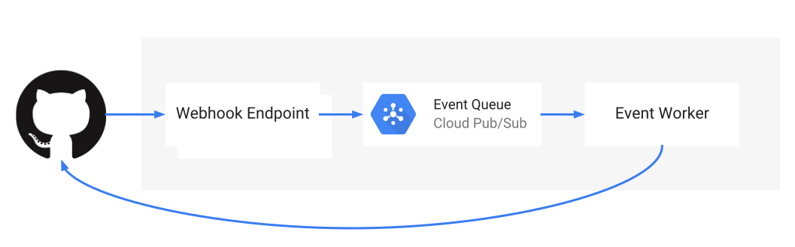

# Go Cloud Contribute Bot Design

Author: [@zombiezen][] 
Date: 2018-08-01 
Part of [#216][]

[@zombiezen]: https://github.com/zombiezen
[#216]: https://github.com/google/go-cloud/issues/216

## Objective

As a maintainer of Go Cloud, there are a number of conventions about format of
issues, pull requests, and commits that keep the project tidy and easy to
navigate. However, new contributors (and even seasoned contributors) forget to
meet these conventions. It adds toil for maintainers of Go Cloud to correct
contributions to match these conventions. The objective is to eliminate
maintainer toil by notifying contributors of convention violations (or even
correcting them automatically where possible).

## Overview

To reduce maintainer toil, this document proposes a [GitHub Application][] that
does various checks. The bot will check the following (but likely more will be
added):

-   Issue title format
-   PR title format
-   Commit message format (one line summary, "Fixes" on last line of description)
-   License headers in new files
-   Branches are in a fork, not on the main repository
-   Removing the "In Progress" label from closed issues

The bot is not responsible for any "correctness" checks: the continuous
integration (CI) must be responsible for such checks.

[GitHub Application]: https://developer.github.com/apps/about-apps/#about-github-apps

## Background: GitHub Applications

From the [GitHub documentation][about-github-apps]:

> GitHub Apps are first-class actors within GitHub. A GitHub App acts on its
> own behalf, taking actions via the API directly using its own identity, which
> means you don't need to maintain a bot or service account as a separate user.
>
> GitHub Apps can be installed directly on organizations and user accounts and
> granted access to specific repositories. They come with built-in webhooks and
> narrow, specific permissions.

GitHub Apps are somewhat like GCP service accounts in that they act as
standalone roles. Administrators of the app can furnish keys for API
authentication, which the server must use in order to act as the GitHub App. A
GitHub App must surface a [webhook][] endpoint over HTTPS to listen for events
from GitHub. At a minimum, this webhook must respond to ping and installation
events.

[about-github-apps]: https://developer.github.com/apps/about-apps/#about-github-apps
[webhook]: https://developer.github.com/webhooks/

## Detailed Design

A highly available webhook endpoint (running on App Engine Standard) will listen
for webhook events from GitHub and write them to a Cloud Pub/Sub topic. A single
event worker (running on Google Kubernetes Engine) will process the event queue
and communicate with the GitHub API to make changes.

Running the webhook on App Engine Standard keeps the availability of the webhook
high and comes with a built-in domain name (appspot.com) and [HTTPS
certificate][App Engine HTTPS certificate]. However, Go Cloud [does not support
App Engine Standard][#210]. This is fine, since the endpoint is going to be
quite fixed and not expected to change frequently.

The event worker must only be running one instance and one subscription, since
running multiple instances can cause confusing concurrent modifications. To
ensure this level of scaling control (as well as leveraging the secrets), the
event worker will run on Google Kubernetes Engine.

[App Engine HTTPS certificate]: https://cloud.google.com/appengine/docs/standard/go/securing-custom-domains-with-ssl
[#210]: https://github.com/google/go-cloud/issues/210

### Event Worker Checks

The primary logic of the event worker will be determining if an event matches
some condition and then taking appropriate action (adding a comment or running
checks). Event payloads include a snapshot of the affected resource, which
allows the event worker to make checks without affecting the [GitHub API rate
limit][]. Since the events are delivered asynchronously, the event worker must
only use the event payload as a hint: if action might be required, it should
query GitHub for the latest state.

It is expected that more checks will be added over time, but they will likely be
refinements of the rules below. Any increase in permission scope should be
accompanied by a design doc.

[GitHub API rate limit]: https://developer.github.com/v3/#rate-limiting

#### Issue Title Format Check

When an [IssuesEvent][] is received indicating an issue has been created or the title has changed:

1.  The issue title is queried to see whether it follows the regex
    `^[a-z0-9/]+: .*$`.
1.  If the title does not follow the regex, then the issue's comments are
    queried to see whether the bot has commented on the improper format since
    the title change.
1.  If no such comment exists, then the event worker issues a comment about the
    title not matching the format.

[IssuesEvent]: https://developer.github.com/v3/activity/events/types/#issuesevent

#### Removing the "In Progress" Label

When an [IssuesEvent][] is received and it indicates the issue has been closed:

1.  The issue is queried to see whether it is still closed and check its labels.
1.  If the issue is closed and its set of labels contains "In Progress", the
    "In Progress" label is removed.

#### Branches in Fork Check

When an [PullRequestEvent][] is received and it indicates a pull request has been created:

1.  Query the current pull request metadata.
1.  If it is in the same repository and it is open, close it with a message to
    the effect of please create pull requests from your own fork and to perhaps
    delete the branch.

[PullRequestEvent]: https://developer.github.com/v3/activity/events/types/#pullrequestevent

#### Pull Request Linting

When an [PullRequestEvent][] is received and it indicates a pull request has
been created or synchronized (the content has changed):

1.  If no check run exists for the latest commit on the pull request, create one
    with an `in_progress` status. If one exists, don't do anything more.
1.  Query the first differing commit's message. If the commit message's first
    line does not match the regex `^[a-z0-9/]+: .*$`, then add a line item to
    the status check output that the message format is wrong and fail the check.
    If the commit message includes the regex (case-insensitive) `Fixes #[0-9]+`
    but this match is not on its own set of lines at the end of the message,
    then add a line item to the status check output that the message format is
    wrong and fail the check.
1.  Query the pull request's description. If the description includes an issue
    number the first differing commit's message does not include it, add a line
    item to the status check output to verify the commit message includes the
    issue information. At most, the check's status will be neutral.
1.  Check any added source files in the latest commit (**TODO: exact set of file
    extensions**) to see if they include the license header. If they do not, add
    an annotation to the first line of the file that a license header is missing
    and fail the check.
1.  If any new imports are added to go.mod, add an annotation to verify that the
    license is one of the `notice`, `permissive`, or `unencumbered` licences
    under the categories [defined by Google Open Source][thirdparty licenses].
1.  If any commits in the pull request have a commit author that is not in the
    [CONTRIBUTORS][] file, then add a line item to the status check output to
    add the contributors to the file and fail the check.

[thirdparty licenses]: https://opensource.google.com/docs/thirdparty/licenses/
[CONTRIBUTORS]: https://github.com/google/go-cloud/blob/master/CONTRIBUTORS

## Redundancy and Reliability

The focus for this application is to ensure that events are not dropped on the
ground. It is acceptable for the worker to be unavailable (impact is simply more
maintainer toil), as long as the queue of events does not build up to the 7 day
limit.

GitHub requires the webhook have [a response time of &lt;10s][GitHub async work]
and does not appear to redeliver events.

*   Cloud Pub/Sub has a [99.95% uptime SLA][Cloud Pub/Sub SLA].
*   App Engine has a [99.95% uptime SLA][App Engine SLA].
*   GitHub itself has no SLA.

Given these SLAs, the webhook listener's maximum uptime SLO is 99.9%.

[GitHub async work]: https://developer.github.com/v3/guides/best-practices-for-integrators/#favor-asynchronous-work-over-synchronous
[Cloud Pub/Sub SLA]: https://cloud.google.com/pubsub/sla
[App Engine SLA]: https://cloud.google.com/appengine/sla

## Security Considerations

This GitHub application will have the following permissions:

*   [Read repository metadata][] (enabled for every GitHub application)
*   [Read & write checks][] (adding annotations to pull requests)
*   [Read & write issues][] (adding comments to issues)
*   [Read & write pull requests][] (adding comments to pull requests)

GitHub applications are scoped to particular installed repositories, so they
cannot act beyond the repositories that a human has explicitly "installed" them
on. This prevents a compromised server or credentials from impacting more than
just the Go Cloud repository.

Communication between GitHub and the webhook endpoint will take place over
HTTPS, and the webhook endpoint will [verify the webhook secret][] in the
payload to ensure that the event came from GitHub.  Communication with Cloud
Pub/Sub occurs over HTTPS, and messages in Cloud Pub/Sub are [encrypted at
rest][Cloud Pub/Sub benefits].

[Read repository metadata]: https://developer.github.com/v3/apps/permissions/#metadata-permissions
[Read & write checks]: https://developer.github.com/v3/apps/permissions/#permission-on-checks
[Read & write issues]: https://developer.github.com/v3/apps/permissions/#permission-on-issues
[Read & write pull requests]: https://developer.github.com/v3/apps/permissions/#permission-on-pull-requests
[verify the webhook secret]: https://developer.github.com/webhooks/securing/
[Cloud Pub/Sub benefits]: https://cloud.google.com/pubsub/docs/overview#benefits

## Privacy Considerations

The bot will only be operating on public GitHub data. Some of this data will be
persisted in a Cloud Pub/Sub queue, but will be deleted after 7 days as per
[Pub/Sub's retention policy][].

[Pub/Sub's retention policy]: https://cloud.google.com/pubsub/docs/faq#persistent

## Testing Plan

This service is largely defined by its interaction with GitHub, but
unfortunately, GitHub does not provide an emulator or staging environment. I see
two possible approaches:

1.  Create a fake GitHub API server. This has the benefit of making the test run
    hermetic and fast, but also has a high upfront development cost. It's also
    possible for the fake to not match real GitHub API behavior. However,
    GitHub's docs include full sample requests and responses, so this might
    still be viable.

1.  Run tests against a sandbox repository. (This appears to be what
    [GitHub recommends][install app on your account].) This is not hermetic, but
    gives higher confidence in the tests. Each dev would create a GitHub
    application and install it to a sandbox repository.

    The local dev setup is somewhat complex, though, since the primary
    interaction is through webhooks, which requires the local server to be
    exposed over HTTPS. [GitHub recommends][GitHub app setup] using
    [smee.io](https://smee.io) or [ngrok](https://ngrok.com/), but these are not
    acceptable in all developer circumstances. A workaround would be to use an
    isolated VM like Google Cloud Shell, but this does complicate local dev
    story. Some of this cost could be mitigated by using HTTP replay, but
    recording would still be a complicated setup.

[install app on your account]: https://developer.github.com/apps/building-your-first-github-app/#install-the-app-on-your-account
[GitHub app setup]: https://developer.github.com/apps/building-your-first-github-app/#one-time-setup

## Related Work

This bot serves a similar purpose to [GopherBot][], but Go Cloud only uses
GitHub data, not Gerrit. While [Maintner][] exists as an eventual consistency
cache to serve GitHub data, Go Cloud is not at the scale yet where rate limiting
would be an issue, so the Contribute Bot just makes direct calls to the GitHub
API.

[GopherBot]: https://github.com/golang/go/wiki/gopherbot
[Maintner]: https://godoc.org/golang.org/x/build/maintner
